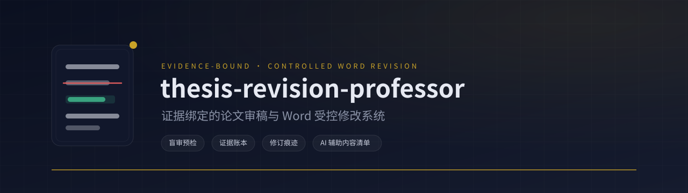
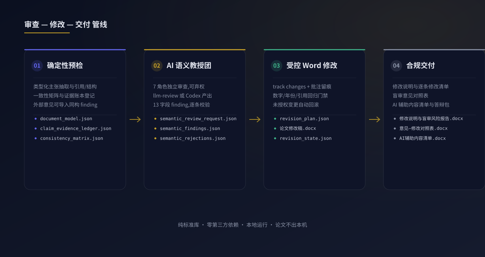
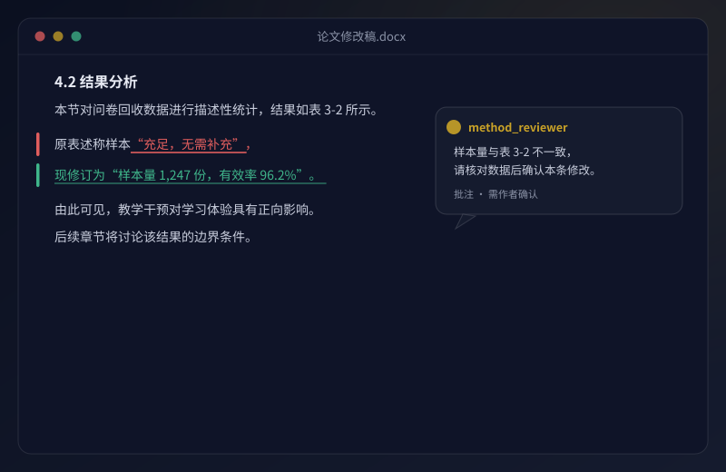
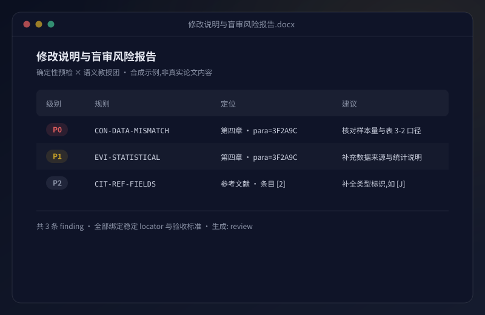
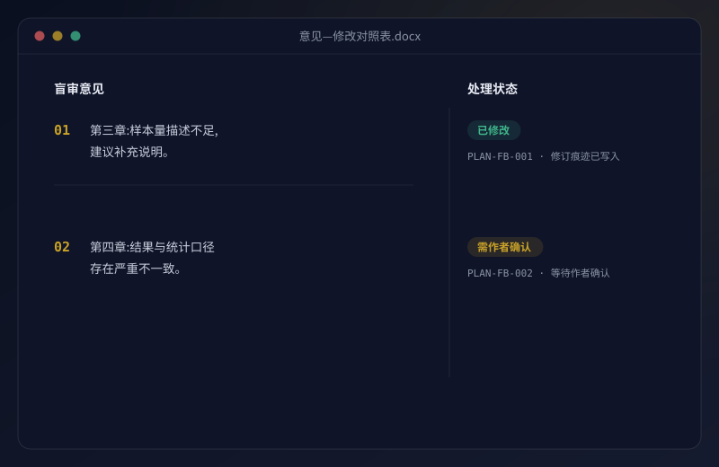

<p align="center">
  
</p>

<h1 align="center">thesis-revision-professor</h1>

<p align="center">
  中文 | <a href="#english-summary">English summary</a>
</p>

<p align="center">
  
  <a href="https://github.com/shidesheng0218/thesis-revision-professor/actions/workflows/test.yml"></a>
  = 3.9">
  
</p>

**一个面向硕士、博士论文修改的开源中文工具:盲审级确定性预检 + AI 语义教授团 + 带 Word 修订痕迹(track changes)的受控修改 + 高校要求的《AI 辅助内容清单》合规导出。** 证据绑定、全程留痕、本地运行;不代写、不编造数据与文献,也不承诺毕业、答辩、盲审、发表或查重结果。

## 目录

- [TL;DR:六个核心能力](#tldr六个核心能力)
- [30 秒体验](#30-秒体验)
- [系统架构](#系统架构)
- [完整混合审稿](#完整混合审稿)
- [产出预览](#产出预览)
- [合规披露(AI 辅助内容清单)](#合规披露ai-辅助内容清单)
- [外部意见导入闭环(可选)](#外部意见导入闭环可选)
- [自动化语义审查(可选)](#自动化语义审查可选)
- [与改写/降重类工具的区别](#与改写降重类工具的区别)
- [合法语料策略挖掘](#合法语料策略挖掘)
- [v3 可信门禁](#v3-可信门禁)
- [v4 可信增强](#v4-可信增强)
- [验证](#验证)
- [学术诚信与版权](#学术诚信与版权)
- [English summary](#english-summary)

## TL;DR:六个核心能力

| | |
| --- | --- |
| **事实锁定与回归回滚** | 数字、年份、样本量、引用一律视为受保护不变量;未授权变更自动回滚,候选稿隔离留证。 |
| **证据账本** | 每条主张登记类型化证据需求与来源(`claim_evidence_ledger.json`),证据不足只标记 `[需作者确认:…]`,绝不代编。 |
| **学科 × 方法路由** | `--discipline` × `--method` 实际切换审查协议,教育学/计算机/法学等 9 大学科、10 类方法族。 |
| **教授团语义审查** | 7 个独立 reviewer 角色,13 字段结构化 finding,可弃权;可手工(Codex)也可 `llm-review` 自动化。 |
| **意见导入闭环** | 盲审/导师意见一键导入同构 finding,生成《意见—修改对照表》,状态随修改自动更新。 |
| **AI 辅助内容清单** | 从机器产物直接生成高校要求的披露清单(审查轮次、修改项、确认状态),缺失产物如实标注。 |

## 30 秒体验

```bash
git clone https://github.com/shidesheng0218/thesis-revision-professor.git
cd thesis-revision-professor
python3 -m thesis_revision_professor demo --outdir demo-output
```

打开:

- `demo-output/修改说明与盲审风险报告.docx`
- `demo-output/逐条修改清单.docx`
- `demo-output/论文修改稿.docx`

安装 CLI(可选,纯标准库、零第三方依赖):

```bash
python3 -m pip install .
thesis-review --help
```

安装为 Codex Skill(可选):

```bash
mkdir -p ~/.codex/skills
git clone https://github.com/shidesheng0218/thesis-revision-professor.git ~/.codex/skills/thesis-revision-professor
```

重启 Codex 后,把论文 `.docx` 路径交给它,并要求使用 `thesis-revision-professor`。

## 系统架构

<p align="center">
  
</p>

## 完整混合审稿

### 五轮深度模式(推荐)

```bash
python3 -m thesis_revision_professor evidence-template ./evidence --out ./evidence/evidence_manifest.json
python3 -m thesis_revision_professor deep-review thesis.docx \
  --level master --discipline education --method qualitative \
  --profile profiles/generic-cn-master.json \
  --evidence-dir ./evidence \
  --outdir outputs/round-001
```

这一步生成 `claim_evidence_ledger.json`、`consistency_matrix.json`、`loop_trace.json` 和 `semantic_review_request.json`。在 Codex 中按语义审查协议生成 `semantic_findings.json`,然后合并:

```bash
python3 -m thesis_revision_professor merge-semantic \
  --review outputs/round-001 \
  --findings semantic_findings.json \
  --outdir outputs/round-002
```

作者确认修改计划后,生成带修订痕迹和批注的 Word:

```bash
python3 -m thesis_revision_professor revise thesis.docx \
  --plan outputs/round-002/revision_plan.json \
  --state outputs/round-002/revision_state.json \
  --tracked --comments \
  --outdir outputs/round-003
```

生成答辩准备包:

```bash
python3 -m thesis_revision_professor defense \
  --review outputs/round-003 \
  --outdir outputs/defense
```

### 第一轮确定性预检

```bash
python3 -m thesis_revision_professor review thesis.docx \
  --level master \
  --discipline education \
  --method qualitative \
  --stage blind-review \
  --outdir outputs/round-001
```

关键输出:

- `document_model.json`:稳定段落定位与原文哈希;
- `claim_evidence_graph.json`:类型化主张—证据关系;
- `selected_strategy.json`:实际生效的学科和方法协议;
- `semantic_review_request.json`:供 Codex 独立语义审查;
- `revision_plan.json`:作者确认契约;
- `revision_state.json`:Issue 生命周期与收敛状态。

在 Codex 完成 `semantic_findings.json` 后重新合并:

```bash
python3 -m thesis_revision_professor review thesis.docx \
  --level master \
  --discipline education \
  --method qualitative \
  --semantic-findings semantic_findings.json \
  --state outputs/round-001/revision_state.json \
  --outdir outputs/round-001-semantic
```

确认 `revision_plan.json` 后执行 Word 修订:

```bash
python3 -m thesis_revision_professor revise thesis.docx \
  --plan outputs/round-001-semantic/revision_plan.json \
  --state outputs/round-001-semantic/revision_state.json \
  --outdir outputs/round-002
```

默认使用 Word 修订痕迹。若数字、年份、引用或 DOCX 部件发生未授权变化,候选稿会被隔离为 `论文修改候选稿-回归未通过.docx`,最终 `论文修改稿.docx` 回滚为原文件。

查看状态:

```bash
python3 -m thesis_revision_professor status outputs/round-002/revision_state.json
```

对比两个版本的跨章节一致性(样本量、日期、编号等事实关系):

```bash
python3 -m thesis_revision_professor consistency \
  --before outputs/round-001/论文修改稿.docx \
  --after outputs/round-002/论文修改稿.docx \
  --out outputs/consistency.json
```

## 产出预览

合成示例,对应真实产物文件名:

<p align="center">
  
  &nbsp;
  
  &nbsp;
  
</p>

- 左:`论文修改稿.docx` — 修订痕迹(track changes)与 Word 批注;
- 中:`修改说明与盲审风险报告.docx` — 级别/规则/定位/建议分级表;
- 右:`意见—修改对照表.docx` — 盲审意见 ↔ 处理状态闭环。

## 合规披露(AI 辅助内容清单)

国内部分高校已要求学位论文附《AI 辅助内容清单》。本工具可从任意轮目录的机器产物直接生成:

```bash
python3 -m thesis_revision_professor disclosure --review outputs/round-001 --outdir outputs/disclosure
```

输出 `AI辅助内容清单.md` / `.docx` / `.json`,汇总每轮审查阶段、参与角色、每条修改计划的执行方式与证据来源、作者确认状态、被拒收的语义 finding 与产物完整性;缺失的产物如实注明"缺失",不补造内容。

## 外部意见导入闭环(可选)

盲审或导师意见可导入受控修改流程,形成"评审意见→受控修改→对照表"闭环:

```bash
python3 -m thesis_revision_professor import-feedback 盲审意见.txt --review outputs/round-001 --outdir outputs/round-002
python3 -m thesis_revision_professor revise thesis.docx --plan outputs/round-002/revision_plan.json --outdir outputs/round-002-applied
```

意见按启发式规则切分(编号/"第X条"优先,切不开整段一条),可定位项进入标记路径,无法定位的项只进人工队列;`revise` 检测到 `feedback_mapping.json` 时自动生成《意见—修改对照表.docx》(状态随 patch 结果更新,不采纳理由由作者填写)。规则见 `references/feedback-protocol.md`。

## 自动化语义审查(可选)

`semantic_findings.json` 除手工编写外,也可通过 OpenAI 兼容 API 自动生成:

```bash
export THESIS_REVIEW_API_KEY=...
export THESIS_REVIEW_MODEL=gpt-4o-mini   # 可选
export THESIS_REVIEW_API_BASE=https://api.openai.com/v1  # 可选
python3 -m thesis_revision_professor llm-review --request outputs/round-001/semantic_review_request.json --out semantic_findings.json
```

只使用标准库 `urllib`,不引入任何第三方依赖;未设置 `THESIS_REVIEW_API_KEY` 时清晰报错退出。输出经过与手工载荷相同的字段校验,被拒 finding 连同原因写入 `rejected_findings`。三点边界:

- 不替代人工判断:产出仍需按 `references/semantic-review-protocol.md` 复核后 merged;
- 不绕过任何门禁:llm-review 只是 `semantic_findings.json` 的另一种生产方式,merge 与后续 converge 门禁完全一致;
- 不联网时整条链路仍可手动跑:手工产出 `semantic_findings.json` 后 `merge-semantic` 行为不变。

## 与改写/降重类工具的区别

市面上多数 AI 论文工具走"自由改写"路线:降重、降 AIGC、整段生成,不区分事实与表达,也不会告诉你改了什么。本工具的设计取向相反:

| 维度 | 本工具 | 降重/改写类工具 |
| --- | --- | --- |
| 事实与数字 | 受保护不变量,未授权变更回滚 | 常被一并改写,难以核对 |
| 证据来源 | 证据账本登记,不足只标记待确认 | 通常不追踪证据 |
| 修改留痕 | Word track changes + 批注 + 计划/状态 JSON | 多为无痕成稿 |
| 合规披露 | 可生成《AI 辅助内容清单》与意见对照表 | 一般不提供 |
| 本地运行 | 纯标准库,论文不出本机 | 多依赖云端 |
| 立场 | 不代写、不编造、不协助规避查重 | 以生成与改写为目标 |

核心精神四条:

- **事实锁定**:数字、年份、样本量、引用、结论的改动一律视为需授权变更,未授权即回滚;证据不足的实质修改只标记 `[需作者确认:…]`,绝不代编;
- **可审计**:每条意见绑定规则、定位与证据来源,修改全程留痕(track changes + 批注 + `revision_plan.json`/`revision_state.json`),并可直接生成高校要求的《AI 辅助内容清单》;
- **本地运行**:论文不离开你的机器,适合未发表成果;
- **立场声明**:不提供、也不协助规避查重或 AIGC 检测的功能。

## 合法语料策略挖掘

先生成权限清单:

```bash
python3 -m thesis_revision_professor rights-template ./legal-corpus --out rights-manifest.json
```

逐文件填写 `allow_derived_strategy`、学科、学位、方法和质量依据后运行:

```bash
python3 -m thesis_revision_professor corpus ./legal-corpus \
  --rights-manifest rights-manifest.json \
  --out outputs/strategy-cards.md
```

未明确授权的文件不会进入分析。聚合产物不保存标题、作者、绝对路径或原文片段;样本量不足 `k=10` 时不会发布可泛化策略。

## v3 可信门禁

- 研究问题与研究目的不会因为没有句内引用而自动判为缺证据;
- 引用表与正文引用分区检查,引用存在不等于语义支持;
- `--discipline` 和 `--method` 会实际选择不同审查协议;
- Issue 使用稳定 fingerprint,支持 open、resolved、reopened、regressed 等状态;
- 修改仅命中稳定 locator,并保留原 DOCX 的媒体与包部件;
- 复杂 OOXML 段落拒绝自动修改;
- 未授权事实、数字和引用变化触发回滚。

## v4 可信增强

- `claim_evidence_ledger.json` 统一登记论文和作者授权材料中的证据;未核验材料不会成为自动改写依据。
- `consistency_matrix.json` 检查摘要、方法、结果、结论、表格和附录之间的事实关系。
- `loop_trace.json` 固定记录五轮深度 Loop;达到上限仍未收敛时标记人工复核。
- `--comments` 为人工判断项写入 Word 批注;批注失败时保留外部清单,不静默丢失。
- `profiles/` 只提供通用安全 profile;学校规范应由用户提供并核对版本。

## 验证

```bash
python3 tests/run_smoke.py
PYTHONPYCACHEPREFIX=/tmp/trp-pycache python3 -m py_compile scripts/*.py thesis_revision_professor/*.py
python3 scripts/release_gate.py
python3 -m pip wheel . --no-deps --no-build-isolation -w /tmp/trp-wheel
```

测试覆盖判断正确性、引用误报、学科路由、Word 部件保留、回归回滚、状态去重、语料权限和隔离 wheel 安装。

## 学术诚信与版权

- 只能处理你有权使用的论文、数据和文献;
- "公开可访问"不等于允许批量抓取、保存或再发布;
- 不在仓库中放置知网、万方、ProQuest 或其他受版权保护论文全文;
- 不复制语料论文措辞,不帮助规避查重;
- 不把本工具的输出冒充未经作者核验的研究事实。

## English summary

`thesis-revision-professor` is an evidence-bound hybrid review and controlled Word revision system for master's and doctoral theses. It combines deterministic integrity gates with Codex semantic review, creates a traceable claim-evidence graph, routes discipline/method protocols, preserves DOCX package parts, and rolls back unauthorized factual changes. It does not guarantee academic outcomes or bundle copyrighted thesis full text.
